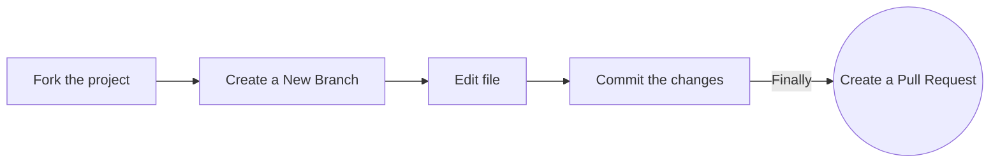
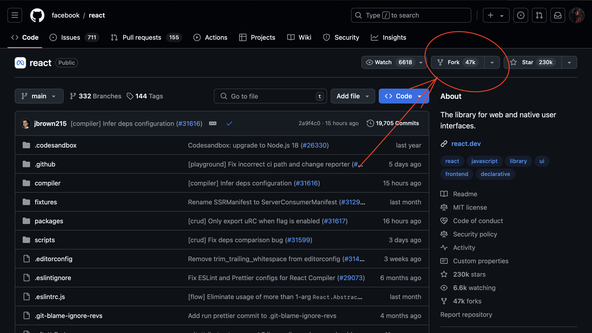
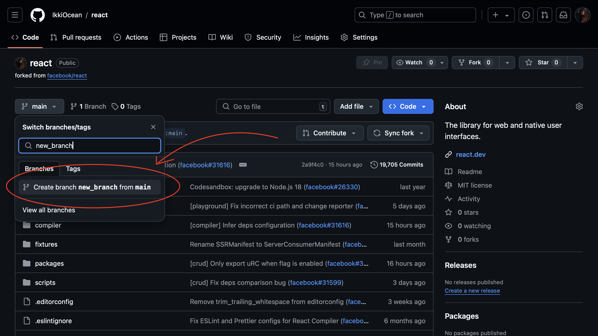
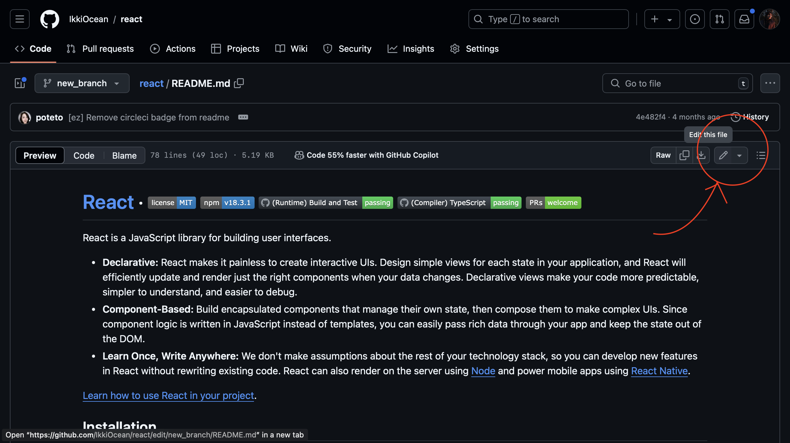
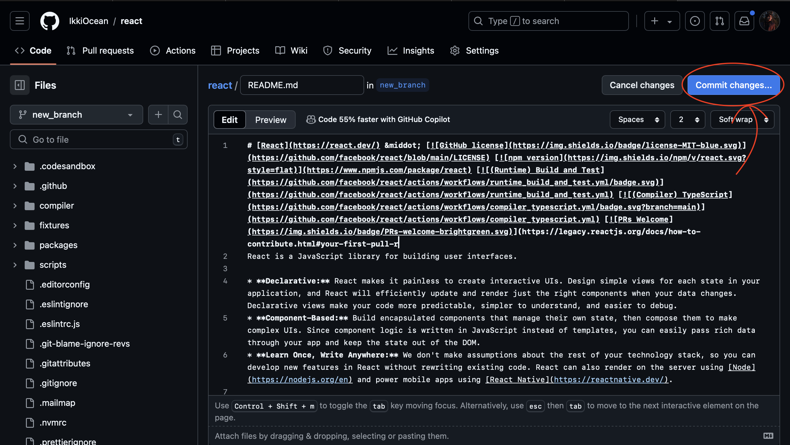
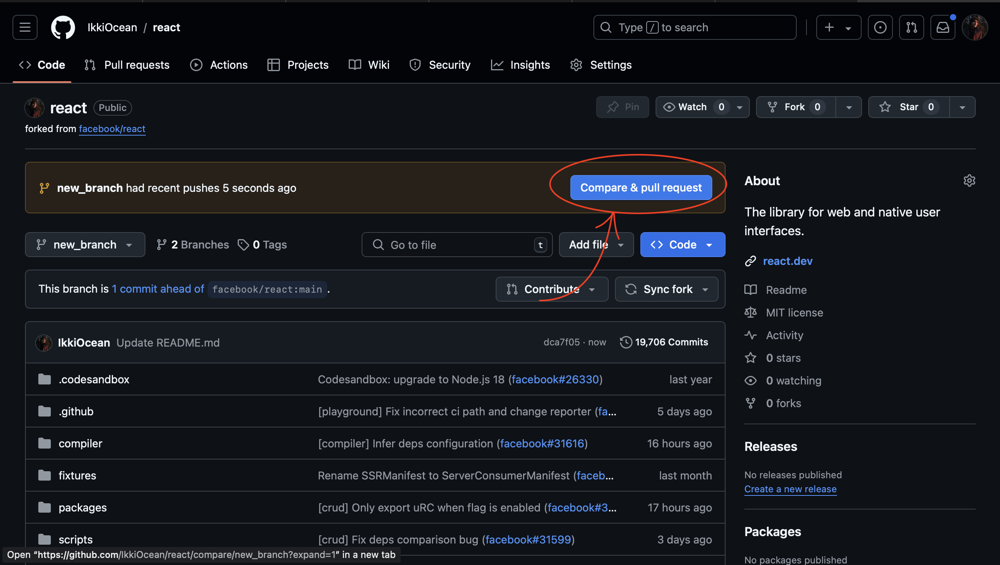
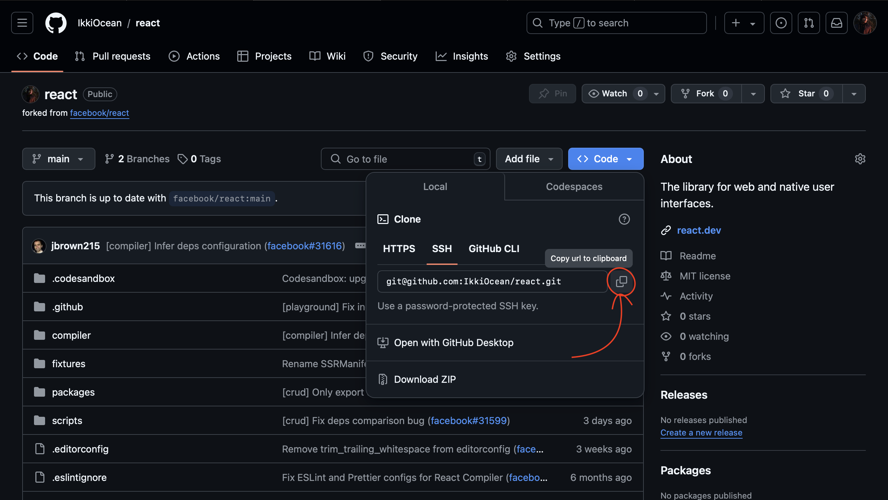
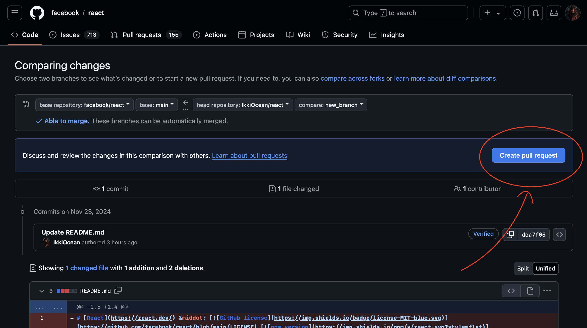

## Follow these steps carefully to ensure a smooth contribution process!

### Option 1. Complete this process in GitHub (in your browser)




**1. Fork the project:**

- Click the gray <kbd>Fork</kbd> button at the top right of the previous page. This creates your copy of the project and saves it as a new repository in your GitHub account.



**2. Create a New Branch:**

- On your new repository's page, click the gray main button in the upper left to reveal a dropdown menu.
- Enter the name of your new branch in the text box. (Branch names usually refer to what is being changed. Example: nameAdd).
  -Click on Create branch <new branch name>, which will automatically take you to your new branch. You can make edits on the main branch, but this may cause issues down the line. The best practice is to create a new branch for each separate issue you work on. That way your main branch remains in sync with main branch.



**3. Make Edits:**  
- Navigate to the file you need to edit (e.g., `README.md`).  
- Use the pencil icon to open the file for editing.  
- Add your changes (e.g., your name and GitHub profile link), keeping the format and order consistent.



**4. Commit Changes:**
- Write a short and descriptive commit message summarizing your changes (e.g., *"Added my name to contributors list"*).  
- Save the changes to the branch you created.



**5. Raise a Pull Request:**

- Click `Pull Requests` option in your forked repository (which is the third option at the top of this page after the options `Code` and `Issues`).
- Click the green New Pull Request button. This will prep the new pull request for you by auto-filling the base repository: base with 'main' And auto-filling your head repository: compare with your repository: main
- Click on your head repository's `compare` dropdown, and switch branches from your 'main' branch to `<new branch name>`.
- Finally, click the green `Create Pull Request` button. Great job! You did it!



### Option 2. Complete this process on your computer (locally)

#### 1. **Fork the Project**  
- Click the gray <kbd>Fork</kbd> button at the top-right corner of the repository page.  
- This creates a copy of the repository under your GitHub account.


#### 2. **Clone the Project to Your Computer**  
- Navigate to your GitHub profile and locate the forked repository.  
- Click on it to open the repository.  
- Click the green <kbd>Code</kbd> button, select HTTPS or SSH, and copy the URL.  

  To download the forked repository to your computer, run the following commands in a terminal:  
  ```bash
  git clone <repository-url>
  ```
  Example:  
  ```bash
  git clone https://github.com/<your-username>/<repo-name>.git
  ```  


- Navigate into the cloned folder:  
  ```bash
  cd <repo-name>
  ```


#### 3. **Open in a Code Editor**  
- Open the project folder in your preferred code editor (e.g., VS Code, Sublime Text).

#### 4. **Create a New Branch**  
- Create a new branch with a unique name. Your username makes a good choice:  
  ```bash
  git checkout -b <new-branch-name>
  ```
  Example:  
  ```bash
  git checkout -b add-my-name
  ```

#### 5. **Make Changes**  
- Identify the file you need to update (e.g., `README.md`) or any other relevant file in the repository.  
- Open the file and make the necessary changes. For instance, if required. 

#### 6. **Stage Your Changes**  
- Stage the changes you made:  
  ```bash
  git add README.md
  ```
  Alternatively, stage all changes:  
  ```bash
  git add .
  ```

#### 7. **Commit the Changes**  
- Commit your changes with a meaningful message:  
  ```bash
  git commit -m "Improved Readme.md"
  ```

- Check the status of your repository to ensure everything is committed:  
  ```bash
  git status
  ```
  Example response:  
  ```text
  On branch <new-branch-name>
  nothing to commit, working tree clean
  ```

#### 8. **Push the Branch to GitHub**  
- Push your branch to your forked repository:  
  ```bash
  git push origin <new-branch-name>
  ```
  If necessary, rename your branch and push:  
  ```bash
  git branch -M main
  git push -u origin main
  ```

#### 9. **Raise a Pull Request**  
- On GitHub, navigate to your forked repository.  
- At the top of the files section, you’ll see a <kbd>Compare & Pull Request</kbd> button. Click it.  


- Review the comparison page to ensure the correct branches are selected (your branch and the main branch of the original repository).  
- Click the green <kbd>Create Pull Request</kbd> button.  



#### 10. **Wait for Review**  
- Your pull request will be reviewed by the maintainers of the original repository.  
- Once approved, it will be merged into the main repository.

---

> **Warning**: If you get an error message like the one below, you probably forgot to fork the repository before cloning it. It is best to start over and fork the project repository first.

```bash
ERROR: Permission to https://github.com/<repo-name> denied to <your-github-username>.
fatal: Could not read from remote repository.
Please make sure you have the correct access rights and that the repository exists.
```
---
